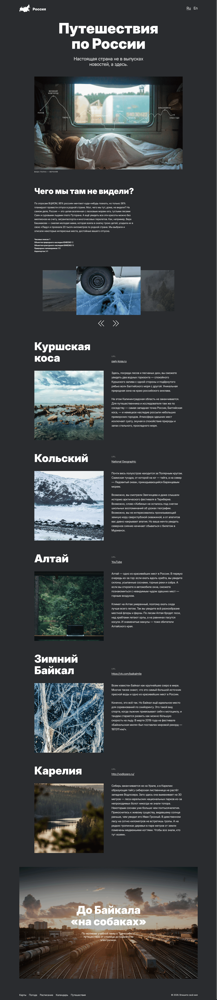

# Путешествия по России · Traveling in Russia

Адаптивный двуязычный лендинг о путешествиях по России — от Куршской косы до зимнего Байкала. Это мой пятый учебный проект: в нём я впервые использовал JavaScript и собрал версии страницы на двух языках (RU / EN).

**Демо:** <https://ggadjiev.github.io/traveling-in-russia/>



## Возможности

- **Две языковые версии.** Русская и английская страницы (`index.html` / `index-en.html`) связаны переключателем языков в шапке — статический подход к локализации без библиотек.
- **Слайдер галереи на чистом JavaScript.** Активный слайд в центре, соседние — уменьшенные и полупрозрачные (30% прозрачности, масштаб 85%) по бокам; навигация кнопками «вперёд» и «назад».
- **Адаптивная вёрстка.** Три контрольные точки — 1280px (ноутбук), 1024px (планшет), 767px (мобильный) — через собственные SCSS-миксины.
- **Семантический HTML5.** Логичная структура секций, подробные `alt`-описания, атрибуты `width`/`height` у изображений (защита от сдвигов макета), `loading="lazy"`.
- **Локальный шрифт Inter** (Regular / Bold / Black, `.ttf`) с `font-display: swap` — сайт не зависит от внешних CDN.

## Технологии

| Технология | Как применена |
| --- | --- |
| **HTML5** | Семантическая разметка, два языковых документа, ленивая загрузка изображений |
| **SCSS** | Точка входа `styles.scss` + 16 партиалов: секции, компоненты и служебные слои; `@import`, `@include` |
| **CSS3** | Grid и Flexbox, кастомные свойства в `:root`, `calc()`, `aspect-ratio`, `scale`/`opacity` для состояний слайдов |
| **JavaScript** | Vanilla JS без библиотек: `querySelector` / `querySelectorAll`, `classList`, `addEventListener`, `findIndex` |
| **Инфраструктура** | GitHub Actions: автоматический деплой содержимого `src/` на GitHub Pages при пуше в `master` |

## SCSS-архитектура

`styles.scss` — точка входа, которая только импортирует партиалы в нужном порядке. Слои устроены так:

- `sections/` — стили восьми секций страницы: header, hero, intro, slider, locations, to-baikal, footer и общие правила `.section`;
- `components/` — изолированные компоненты (переключатель языков);
- `_media.scss` — контрольные точки (`$laptop: 1280px`, `$tablet: 1024px`, `$mobile: 767px`) и одноимённые миксины `laptop` / `tablet` / `mobile` — применяются по всему проекту 26 раз;
- `_mixins.scss` — утилиты `reset-link`, `reset-button` и семейство `fluid-font` / `fluid-width` / `fluid-height` для плавных размеров на `calc()` (заготовлены на будущее);
- `_variables.scss` — дизайн-токены (цвета, шрифты, интерлиньяж, отступы) в `:root`; часть значений переопределяется на контрольных точках;
- `_utils.scss` — контейнеры `container-large` / `container-small` и сбросы их паддингов;
- `_normalize.scss`, `_fonts.scss`, `_globals.scss` — нормализация, `@font-face` и базовая типографика.

## Структура проекта

```
traveling-in-russia/
├── .github/
│   └── workflows/
│       └── static.yml            # деплой src/ на GitHub Pages при пуше в master
├── .gitignore
├── README.md
└── src/                          # корень публикуемого сайта
    ├── index.html                # русская версия страницы
    ├── index-en.html             # английская версия страницы
    ├── script.js                 # логика слайдера галереи
    ├── css/
    │   └── styles.css            # скомпилированный CSS (коммитится в репозиторий)
    ├── styles/                   # SCSS-исходники
    │   ├── styles.scss           # точка входа — только @import-ы
    │   ├── _normalize.scss       # нормализация стилей
    │   ├── _fonts.scss           # @font-face для Inter (3 начертания)
    │   ├── _variables.scss       # дизайн-токены в :root
    │   ├── _mixins.scss          # reset-*, fluid-* миксины
    │   ├── _media.scss           # брейкпоинты + миксины laptop/tablet/mobile
    │   ├── _globals.scss         # базовая типографика
    │   ├── _utils.scss           # контейнеры и их сбросы
    │   ├── sections/             # стили секций страницы (8 файлов)
    │   └── components/           # компоненты (переключатель языков)
    ├── fonts/                    # Inter: Regular, Bold, Black (.ttf)
    ├── img/                      # PNG-изображения (~6 МБ)
    └── icons/                    # SVG: логотип, стрелки слайдера, маршрут
```

## Локальный запуск

Скомпилированный CSS уже лежит в репозитории, поэтому посмотреть проект проще всего так:

```bash
git clone https://github.com/GGadjiev/traveling-in-russia.git
cd traveling-in-russia
npx serve src        # или просто открыть src/index.html в браузере
```

## Сборка SCSS

Сборщика в проекте нет: SCSS компилируется локально, а результат (`src/css/styles.css`) коммитится в репозиторий. Деплой не компилирует стили сам, поэтому после каждой правки SCSS пересобирайте CSS и коммитьте оба файла вместе.

```bash
# вариант 1: Dart Sass через npx
npx sass src/styles/styles.scss src/css/styles.css --no-source-map

# вариант 2: расширение VS Code Live Sass Compiler
# (output нужно направить в ../css, а не в styles/)
```

## Деплой

Публикацией управляет workflow `.github/workflows/static.yml`: при пуше в `master` (или при ручном запуске из вкладки Actions) GitHub Actions упаковывает содержимое папки `src/` и разворачивает его на GitHub Pages.

- Русская версия: <https://ggadjiev.github.io/traveling-in-russia/>
- Английская версия: <https://ggadjiev.github.io/traveling-in-russia/index-en.html>

## Чему я научился

- Писать первый интерактив на чистом JavaScript: обработчики событий, поиск активного слайда через `findIndex`, управление модификаторами через `classList`.
- Реализовывать двуязычность статического сайта через два связанных HTML-документа.
- Проектировать модульную SCSS-архитектуру: точка входа, партиалы по слоям, собственные миксины контрольных точек.
- Строить адаптивные сетки на Grid и Flexbox и управлять ими через CSS-переменные.
- Настраивать автоматический деплой статического сайта на GitHub Pages через GitHub Actions.

## Планы по доработке

- Зациклить слайдер — сейчас он останавливается на первом и последнем слайде.
- Добавить свайп-жесты для мобильных устройств.
- Анимировать переход между слайдами (плавное изменение прозрачности и масштаба соседних слайдов).
- Применить заготовленные миксины `fluid-*` вместо фиксированных размеров на контрольных точках.
- Оптимизировать изображения: WebP/AVIF вместо PNG (папка `img/` весит около 6 МБ).
- Добавить favicon, `meta description` и Open Graph-разметку для ссылок в соцсетях.

## Благодарности

Контент и дизайн-макет — из брифа «Путешествия по России» учебной программы [Яндекс Практикума](https://practicum.yandex.ru/). Вёрстка, SCSS и JavaScript — [Gadjimurad Gadjiev](https://github.com/GGadjiev).